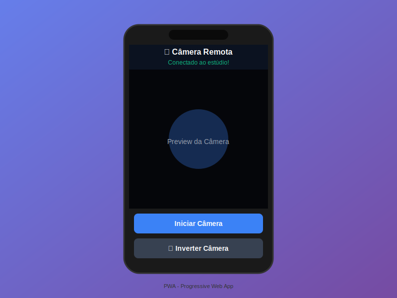

# 📱 Câmera Remota PWA

Progressive Web App para usar seu smartphone como câmera remota em estúdios de streaming profissionais.



## 📚 Documentação

- **[⚡ Início Rápido](INICIO-RAPIDO.md)** - Comece em 2 minutos
- **[🚀 Guia de Deploy](DEPLOY.md)** - Publicar no GitHub Pages, Vercel, Netlify
- **[🔌 Integração com Backend](INTEGRACAO.md)** - Conectar ao servidor Node.js
- **[🎥 Exemplos de Uso](EXEMPLOS.html)** - Casos de uso reais
- **[🔧 Especificações Técnicas](SPECS.md)** - Arquitetura e APIs
- **[📊 Fluxo de Conexão](assets/fluxo-conexao.svg)** - Diagrama visual

---

## 🎯 Características

- ✅ **PWA Completo**: Instalável em Android e iOS
- ✅ **Offline-First**: Funciona mesmo sem conexão (após primeira instalação)
- ✅ **WebRTC**: Conexão peer-to-peer de baixa latência
- ✅ **Multi-Câmera**: Suporte para câmeras frontal e traseira
- ✅ **HD/Full HD**: Captura em alta qualidade (até 1920x1080)
- ✅ **Áudio Integrado**: Transmite áudio junto com vídeo
- ✅ **QR Code**: Conexão rápida via QR Code

---

## 🚀 Como Usar

### 1. Hospedar o App

Você pode hospedar este app em qualquer servidor HTTPS. Algumas opções gratuitas:

#### **GitHub Pages** (Recomendado)

```bash
# 1. Crie um repositório no GitHub
# 2. Faça upload de todos os arquivos desta pasta
# 3. Vá em Settings → Pages → Source → main branch
# 4. Seu app estará disponível em: https://SEU_USUARIO.github.io/NOME_REPO/
```

#### **Vercel**

```bash
npm install -g vercel
cd camera-remota-pwa
vercel --prod
```

#### **Netlify**

```bash
npm install -g netlify-cli
cd camera-remota-pwa
netlify deploy --prod --dir=.
```

#### **Firebase Hosting**

```bash
npm install -g firebase-tools
firebase login
firebase init hosting
firebase deploy
```

---

### 2. Configurar API Backend

Edite o arquivo [index.html](index.html) na linha que define `API_BASE_URL`:

```javascript
// Altere esta linha para apontar para seu servidor backend
const API_BASE_URL = new URLSearchParams(window.location.search).get("api") || "https://SEU_SERVIDOR_API.com";
```

**Ou** use via query string (sem editar código):

```
https://seu-app.vercel.app/?api=https://seu-servidor.com&session=abc123
```

---

### 3. Conectar ao Estúdio

#### **No Desktop (Estúdio)**

1. Abra `http://localhost:3000/studio.html` (ou seu servidor)
2. Clique em **"📱 Câmera do Celular"**
3. Um QR Code será exibido

#### **No Celular**

**Opção A: Via QR Code** (Recomendado)
1. Aponte a câmera do celular para o QR Code
2. Abra o link que aparecer
3. Clique em **"Instalar App"** (se disponível)
4. Permita acesso à câmera e microfone
5. Clique em **"Iniciar Câmera"**

**Opção B: Manual**
1. Digite no navegador: `https://seu-app.vercel.app/?session=ID_DA_SESSAO`
2. Siga os passos 3-5 acima

---

## 📂 Estrutura do Projeto

```
camera-remota-pwa/
├── index.html              # Página principal do app
├── manifest.json           # Manifesto PWA (metadados, ícones, cores)
├── sw.js                   # Service Worker (cache offline)
├── assets/
│   └── icons/
│       ├── icon-192.svg    # Ícone 192x192
│       └── icon-512.svg    # Ícone 512x512
└── README.md               # Esta documentação
```

---

## 🔧 Requisitos Técnicos

### **Servidor**

- ✅ **HTTPS obrigatório** (PWA só funciona em HTTPS ou localhost)
- ✅ Content-Type correto para `.json` → `application/json`
- ✅ Content-Type correto para `.svg` → `image/svg+xml`

### **Backend API**

O app espera que o backend exponha os seguintes endpoints:

```
POST /api/v1/phone-camera/sessions/{sessionId}/offer
Body: { "offer": RTCSessionDescription }
Response: { "answer": RTCSessionDescription }
```

### **Navegador (Celular)**

- ✅ Chrome/Edge 90+
- ✅ Safari 14.5+ (iOS)
- ✅ Firefox 88+

---

## 📱 Como Instalar no Celular

### **Android (Chrome/Edge)**

1. Abra o app no navegador
2. Toque no botão **"⬇ Instalar App"** que aparece na tela
3. Ou toque no menu (⋮) → **"Adicionar à tela inicial"**
4. O app será instalado como aplicativo nativo

### **iOS (Safari)**

1. Abra o app no Safari
2. Toque no botão **Compartilhar** (quadrado com seta)
3. Role e toque em **"Adicionar à Tela de Início"**
4. Toque em **"Adicionar"**
5. O app aparecerá na tela inicial como aplicativo

---

## 🎨 Personalização

### **Cores e Logo**

Edite [manifest.json](manifest.json):

```json
{
  "name": "Seu App Personalizado",
  "short_name": "SeuApp",
  "theme_color": "#SUA_COR_PRIMARIA",
  "background_color": "#SUA_COR_FUNDO"
}
```

### **Ícone Personalizado**

Substitua os arquivos em `assets/icons/`:
- `icon-192.svg` → 192x192px
- `icon-512.svg` → 512x512px

Pode usar PNG também (basta alterar `type` no manifest):

```json
{
  "src": "/assets/icons/icon-192.png",
  "type": "image/png"
}
```

---

## 🔒 Segurança

- ✅ **HTTPS obrigatório** em produção
- ✅ Service Worker valida origem das requisições
- ✅ WebRTC usa STUN server do Google (sem TURN por padrão)
- ⚠️ **Importante**: Valide `sessionId` no backend para evitar conexões não autorizadas

---

## 🐛 Troubleshooting

### **Botão "Instalar App" não aparece**

- Verifique se está em **HTTPS** (ou localhost)
- Verifique se o `manifest.json` está acessível
- Abra DevTools → Application → Manifest (deve estar sem erros)
- Alguns navegadores exigem **2+ visitas** antes de mostrar o prompt

### **Câmera não inicia**

- Verifique permissões de câmera/microfone no navegador
- No iOS, permissões só funcionam em **Safari** (não Chrome/Firefox)
- Certifique-se de estar em **HTTPS** (getUserMedia não funciona em HTTP)

### **Não conecta ao estúdio**

- Verifique se `API_BASE_URL` está correto
- Confirme que o backend está respondendo em `/api/v1/phone-camera/sessions/{id}/offer`
- Abra DevTools → Console (veja erros de rede)
- Verifique se há firewall bloqueando WebRTC

### **Service Worker não atualiza**

```javascript
// No DevTools → Application → Service Workers
// Clique em "Unregister" e recarregue a página
```

---

## 📄 Licença

Este projeto está sob a licença MIT. Use livremente em projetos pessoais e comerciais.

---

## 🤝 Integração com Backend

Se você está usando o backend Node.js da API de streaming, o app já está 100% compatível. Certifique-se de que:

1. O servidor backend está rodando (`npm start`)
2. O endpoint `/api/v1/phone-camera/sessions/:sessionId/offer` está ativo
3. CORS está habilitado para o domínio do PWA

---

## 📊 Estatísticas de Cache

O Service Worker faz cache dos seguintes recursos:

- `index.html` (14 KB)
- `manifest.json` (0.5 KB)
- `sw.js` (2 KB)
- `icon-192.svg` (0.8 KB)
- `icon-512.svg` (1 KB)

**Total:** ~18 KB (extremamente leve!)

---

## 🚀 Próximos Passos

Após subir no GitHub/Vercel/Netlify:

1. Teste a instalação em um dispositivo Android
2. Teste a instalação em um dispositivo iOS
3. Valide o funcionamento offline (modo avião após primeira carga)
4. Configure notificações push (opcional, requer backend adicional)
5. Adicione analytics (Google Analytics, Plausible, etc.)

---

**Desenvolvido com ❤️ usando HTML, CSS e JavaScript puro (zero dependências)**
